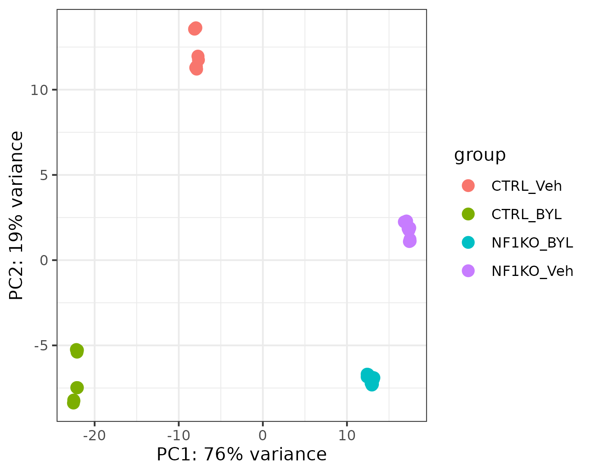
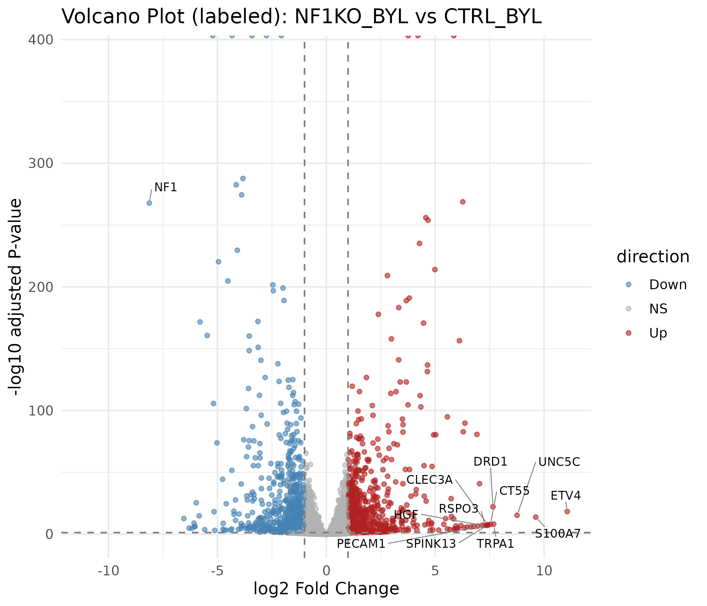
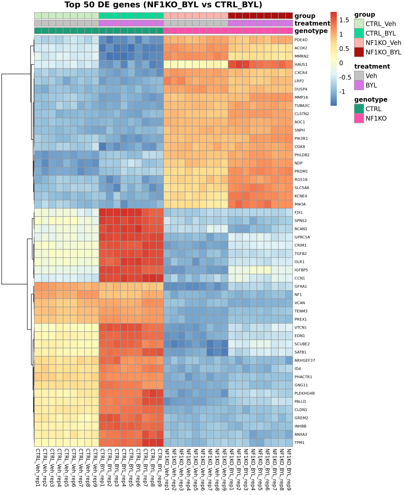
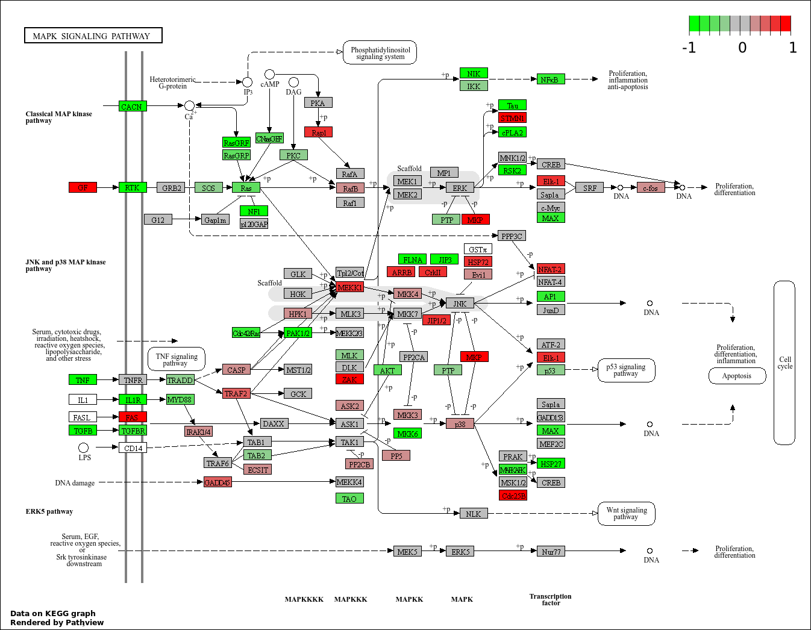

# NF1 Loss Drives PI3Kα Inhibitor Resistance - RNA-seq Reanalysis (GSE207514)

This repo is an **independent reanalysis** of public RNA-seq data from **[GSE207514](https://www.ncbi.nlm.nih.gov/geo/query/acc.cgi?acc=GSE207514)**, provided as part of the study by Auf der Maur et. al, Cell Rep Med, 2023 ([PMID: 37044095](https://pubmed.ncbi.nlm.nih.gov/37044095/)).

While the authors present a large and multi-modal study, which delivers an insightful story, the analysis details for the GSE207514 (T47D RNA-seq) dataset are not provided. 

This repository reconstructs the complete RNA-seq workflow from the raw FASTQ files, including 
- Read processing (STAR + featureCounts), 
- DESeq2 modeling, 
- Visualization (PCA, volcano plots, heatmaps), and 
- Pathway-level exploration (Hallmark/Reactome GSEA + KEGG via Pathview), 
as well as an **explicit three-contrast design** for this dataset:

These three contrasts correspond to:
1. CTRL_BYL vs CTRL_Veh – drug effect in NF1-intact cells.
2. NF1_Veh vs CTRL_Veh – baseline transcriptional effect of NF1 loss.
3. NF1_BYL vs CTRL_BYL – NF1-mediated resistance under PI3Kα inhibition.

The original paper does not explicitly describe this three-contrast design for the T47D RNA-seq subset; here it is made explicit to clarify the experimental logic.

Through this, I was able to highlight detailed features such as the FOXO-associated inhibitor response in CTRL cells, reflecting a classical stress program induced by PI3K inhibition, and persistent MAPK, E2F, MYC, and G2M activity in NF1-KO cells under the inhibition, which act as bypass mechanisms that sustain proliferation. 

While the original study does not specify the methods, I use STAR, featureCounts for alignment and quantification. For differential expression, I use DESeq2, while the authors have used edgeR (see Tables S6 and S7 of the paper). I also use Hallmark and Reactome gene sets for pathway-level enrichment analysis, while the authors used Hallmark and MsigDB (see Figure S3 of the paper). 

Using alternative methods where the authors' method is known helps validate the robustness and reproducibility of their reported findings.

---

This project aims to:

- **Demonstrates my skills** in RNA-seq analysis (STAR alignment, DESeq2, GSEA, Pathview, visualization) on a real oncology signaling dataset.
- **Reproduce and validate the authors' main conclusions** about NF1-loss-mediated resistance to the PI3Kα inhibitor Alpelisib.
- **Provide an enhanced analysis** compared to the original study by:
  - Emphasizing KRAS/MAPK vs PI3K signaling using Hallmark + Reactome GSEA and KEGG overlays. 
  - Inspecting heatmaps of top DE genes to visualize FOXO-like drug response programs under Alpelisib (BYL719; the PI3Kα drug used in the study).
  - *This level of ranked-gene expression patterning is not shown in the original figures and adds a clear view of condition-specific expression shifts.*

## Background

- The PI3K/AKT/mTOR signaling axis is a key driver in hormone receptor-positive (HR+) / HER2-negative breast cancer.
- PI3KCA mutations is present in ~40% of cases.
- Alpelisib (BYL719; a PI3Kα inhibitor) improves progression-free survival in PIK3CA-mutant patients.
- However, reisistance builds.
- NF1, a tumor supressor and RAS-GAP, when absent, has been identified to enable bypassing of PI3Kα inhibition by Alpelisib.
- By reanalyzing this dataset, I indenpendently examine how NF1 loss reshapes drug response at the transcriptome level. In particular I examine:
    - which findings are reproducible under a slightly different analytical approach, and
    - how broad PI3K and MAPK pathway activities reorganize under NF1 loss.

## Dataset

- RNA-seq data from GEO series GSE207514.
- Profiles T47D ER+ breast cancer cells harboring PI3KCA H1047R mutation.
- Includes 4 groups:
    - CTRL_Veh (control, vehicle)
    - CTRL_BYL (control, alpelisib)
    - NF1_Veh (NF1 knockout, vehicle)
    - **NF1_BYL (NF1 knockout, Alpelisib)** 

- This design allows separation of 
    - drug effects,
    - NF1 knockout effect, and
    - NF1-driven drug resistance

Supplementary metadata provided in this repo:
- `data/metadata/GSE207514_treatment_notes.md` — treatment details and mapping notes.
- `data/metadata/SraRunTable.csv` — GEO SRA run metadata used to derive `runs.tsv`.

## Primary Comparisons

1. Drug effect in control cells
- CTRL_BYL vs CTRL_Veh
- Question: What does alpelisib do in NF1-intact PI3KCA H1047R cells?

2. NF1 loss at baseline
- NF1_Veh vs CTRL_Veh
- Question: How does NF1 loss alone change signaling and transcription?

3. NF1-mediated resistance under drug (*main project goal*) 
- NF1_BYL vs CTRL_BYL
- Question: When treated with alpelisib, how do the drug-resistant NF1-KO cells' gene expression profiles differ from the drug-sensitive CTRL cells? 

## Methods

The analysis is organized into two stages:

1. **`scripts/counts_pipeline/`** – scripts that will regenerate the raw count matrix from FASTQ files.
2. **`analysis/01_deseq/`** – the full downstream DESeq2-based transcriptomic analysis used in this reanalysis.

---

### `scripts/counts_pipeline/` 

This folder contains a complete count-generation pipeline that produces a raw gene-by-sample count matrix from FASTQ files.  

(*Warning: It took 3+ days on my laptop to run this process. You may jump to the `analysis` pipeline and use the GEO-provided count table instead."*)

The workflow:

1. **Create run metadata**
   - Use `00_make_runs_tsv.R` to build `data/metadata/runs.tsv` from the GEO run info.

2. **Download References (FASTA + GTF)**
  - Run `bash scripts/counts_pipeline/00_download_reference.sh` to fetch GENCODE v45 (GRCh38) into `data/reference/`.

3. **Build STAR Index**
  - Run `bash scripts/counts_pipeline/01_build_star_index.sh 8 100` to build the STAR index under `data/star_index/`.
  - Args: `threads` (default 8) and `sjdbOverhang` (default 100).

3. **Download FASTQs**
   - Run `01_download_fastq_all.sh` to download all FASTQ files for the runs in `runs.tsv`.

4. **Quality control**
   - Run `02_fastqc.sh` on the downloaded FASTQs.

5. **Optional trimming**
   - Use `03_trim_reads.sh` (Trimmomatic) if adapter or quality trimming is needed.

6. **Alignment with STAR**
  - Run `04_star_align.sh` to align reads using the STAR genome index.
  - Produces sorted BAM files per sample under `data/aligned/`.

7. **Quantification with featureCounts**
   - Run `05_featurecounts.sh` to assign aligned reads to genes.
   - Generates a unified raw count matrix across samples.

8. **Summarize counts**
   - Use `06_summarize_counts.R` to tidy the featureCounts output.
   - Saves:
     - `counts_matrix.raw.rds`
     - `gene_annotation.rds`

The count table provided by GSE207514 will be validated from this output reproduced from raw FASTQ files.

---

### `analysis/01_deseq/` – Downstream RNA-seq analysis

This folder contains all steps from count loading to differential expression, visualization, and pathway interpretation.

#### 1. Load counts and metadata  
**`01_load_counts.R`**
- Reads the GEO count table.
- Separates annotation from counts.
- Builds `sample_info` (genotype, treatment, group).
- Saves:  
  - `counts_matrix.rds`  
  - `gene_annotations.rds`  
  - `sample_info.rds`

#### 2. Build DESeq2 objects and run DESeq  
**`02_build_dds_and_deseq.R`**
- Constructs two DESeq2 datasets:  
  - `dds_vehRef` (reference level: `CTRL_Veh`)  
  - `dds_bylRef` (reference level: `CTRL_BYL`)
- Filters low-count genes.
- Runs `DESeq()`.
- Saves both fitted objects.

#### 3. Variance stabilizing transform and PCA  
**`03_vst_pca.R`**
- Applies VST to `dds_vehRef`.
- Generates PCA plot colored by group.
- Saves `data/processed/deseq/vsd.rds` and PCA figure under `results/pca/figures/`.

#### 4. Differential expression  
- **`04_deg_ctrl_byl_vs_ctrl_veh.R`**
- **`05_deg_nf1ko_veh_vs_ctrl_veh.R`**
- **`06_deg_nf1ko_byl_vs_ctrl_byl.R`**

Each script:
- Extracts the appropriate contrast from DESeq2.
- Writes full and filtered DEG tables.
- Prints counts of up- and down-regulated genes.

#### 5. Volcano plots  
- **`07_volcano_basic.R`** – simple volcano plots for all contrasts.  
- **`07_volcano_detailed.R`** – labeled volcano plots with shared axes.

#### 6. GSEA (Hallmark + Reactome)  
**`08_gsea_nf1ko_byl_vs_ctrl_byl.R`**
- Uses **apeglm-shrunken** log2FC (DESeq2 log2 fold-changes with apeglm shrinkage to stabilize estimates).
- Saves shrunken results to `results/gsea/tables/NF1KO_BYL_vs_CTRL_BYL_shrunk_results.csv`.
- Runs GSEA with Hallmark and Reactome gene sets (msigdbr v10+; KEGG not provided).
- Saves enrichment tables to `results/gsea/tables/` and figures to `results/gsea/figures/`.

#### 7. KEGG pathway overlays  
**`09_pathview_nf1ko_byl_vs_ctrl_byl.R`**
- Reads shrunken LFCs from `results/gsea/tables/NF1KO_BYL_vs_CTRL_BYL_shrunk_results.csv`.
- Maps log2FC values onto KEGG PI3K-Akt and MAPK pathways using Pathview.
- Produces PNG pathway diagrams in `results/pathview/figures/`.

#### 8. Heatmap of top DE genes  
**`10_pheatmap_nf1ko_byl_vs_ctrl_byl.R`**
- Selects top DE genes from the NF1KO_BYL vs CTRL_BYL comparison (`results/deg/tables/DEG_NF1KO_BYL_vs_CTRL_BYL.csv`).
- Extracts VST expression values from `data/processed/deseq/vsd.rds` and performs row-scaling.
- Uses `data/processed/gene_annotations_entrez.rds` to label rows with SYMBOL where available.
- Orders samples as: `CTRL_Veh → CTRL_BYL → NF1_Veh → NF1_BYL`.
- Saves heatmap (PNG + PDF) to `results/heatmap/figures/`.

## Key Results 

### Example Outputs

Below are a few representative outputs generated by the pipeline.
(All figures are reproducible by running the scripts in `scripts/counts_pipeline/` and `analysis/01_deseq/`.)

#### Gene Expression Count


The gene expression count output of this pipeline is in excellent overall agreement to the count table provided by the GEO (method detail unknown).


Zooming in to see individual gene expression levels (relative to the mean) amongst samples (CTRL/NF1KO x Veh/BYL), we see they are also in great agreement. Gene highly relevant to the study are selected for review.


#### PCA (group separation)


#### Volcano plot (NF1KO_BYL vs CTRL_BYL)


#### Hallmark GSEA dotplot


#### Heatmap of top DE genes


#### KEGG pathway overlay (MAPK)


### Validation of the original analysis

- **NF1KO cells maintain KRAS/MAPK activity** even under PI3Kalpha inhibition (BYL).
- **CTRL cells** show a strong BYL719-induced FOXO/stress-like response that is **blunted** in NF1KO cells.  
- NF1KO cells fail to activate many of PI3K-inhibitor-response genes, matching the resistance phenotype described by the authors.

### Additional findings from this reanalysis

- Systematic Reactome enrichment (not emphasized in the original study) reveals more detailed pathway-level distinctions, such as persistent E2F/MYC and G2M checkpoint signals in NF1KO + BYL.
- The heatmap of the top 50 DE genes highlights a sharp separation between:
    - BYL-induced FOXO-like genes rising only in CTRL, and
    - MAPK-feedback genes staying high in NF1KO under drug.
    - This expression-pattern view is complementary to the original study’s pathway summaries.
- Pathview overlays provide node-level pathway regulations:
  - Downregulation of several PI3K inputs (e.g., ERBB2, PIK3CD).
  - Upregulation of HRAS–RAF–ERK components in NF1KO + BYL.

Together, these confirm and extend the interpretation that:
> NF1 loss reduces dependence on PI3Kα and enables escape through Ras-driven parallel signaling.

### How to run the main pieces

### Create env from environment.yml

```bash
micromamba env create -f environment.yml
micromamba activate nf1-rnaseq
```

### 1) (Optional) Regenerate counts from FASTQ – `scripts/counts_pipeline/`

  > Use this if you want to start from raw FASTQ files and reproduce alignment/quantification.  
  > If you only need to reproduce the DESeq2 / GSEA analysis from the GEO-provided count table, you can skip to **2) Downstream DESeq2 analysis**.

From the project root:

```bash
# 0. Install R packages (once, inside nf1-rnaseq env)
Rscript scripts/install_R_packages.R

# 1. Create run metadata
Rscript scripts/counts_pipeline/00_make_runs_tsv.R

# 2. Download FASTQs
bash scripts/counts_pipeline/01_download_fastq_all.sh

# 3. Quality control
bash scripts/counts_pipeline/02_fastqc.sh

# 4. Optional trimming (Trimmomatic)
bash scripts/counts_pipeline/03_trim_reads.sh

# 5. Alignment with STAR
bash scripts/counts_pipeline/04_star_align.sh

# 6. Quantification with featureCounts
bash scripts/counts_pipeline/05_featurecounts.sh

# 7. Summarize counts
Rscript scripts/counts_pipeline/06_summarize_counts.R

# 8. Convert Ensembl IDs to ENTREZ/SYMBOL
Rscript scripts/counts_pipeline/07_convert_ensembl_to_entrez_and_symbol.R
```

Outputs (key locations):

- **Metadata**
  - `data/metadata/runs.tsv` – run-level metadata generated from GEO
  - `data/metadata/GSE207514_treatment_notes.md` – treatment notes for the experiment
  - `data/metadata/SraRunTable.csv` – original SRA run table from GEO

- **Raw reads and QC**
  - `data/fastq/` – downloaded FASTQ files (naming matches `runs.tsv`)
  - `results/fastqc/figures` – FastQC images
  - `results/fastqc/logs` – FastQC logs

- **Trimmed reads (optional)**
  - `data/trimmed_fastq/` – trimmed FASTQs from Trimmomatic

- **Alignments**
  - `data/star_index/` – STAR genome index
  - `data/aligned/` – sorted BAM files per sample
  - `results/star/logs` – STAR alignment logs

- **Counts**
  - `data/counts/featurecounts/` – raw featureCounts outputs
  - `results/featurecounts/logs` – featureCounts logs
  - `data/processed/` – summarized objects, e.g.:
    - `counts_matrix_ensembl.rds`
    - `counts_matrix_ensembl.csv`
  - Derived matrices/annotations (after step 8):
    - `data/processed/counts_matrix_entrez.rds`
    - `data/processed/counts_matrix_symbol.rds`
    - `data/processed/gene_annotations_entrez.rds`


### 2) Downstream DESeq2 analysis – `analysis/01_deseq/`

From the project root:

```bash
Rscript analysis/01_deseq/01_load_counts.R
Rscript analysis/01_deseq/02_build_dds_and_deseq.R
Rscript analysis/01_deseq/03_vst_pca.R
Rscript analysis/01_deseq/04_deg_ctrl_byl_vs_ctrl_veh.R
Rscript analysis/01_deseq/05_deg_nf1ko_veh_vs_ctrl_veh.R
Rscript analysis/01_deseq/06_deg_nf1ko_byl_vs_ctrl_byl.R
Rscript analysis/01_deseq/07_volcano_basic.R
Rscript analysis/01_deseq/07_volcano_detailed.R
Rscript analysis/01_deseq/08_gsea_nf1ko_byl_vs_ctrl_byl.R
Rscript analysis/01_deseq/09_pathview_nf1ko_byl_vs_ctrl_byl.R
Rscript analysis/01_deseq/10_pheatmap_nf1ko_byl_vs_ctrl_byl.R
```

Outputs (key locations):

- **DESeq2 objects and DEG tables**
  - `data/processed/deseq/` – `dds_*.rds`, `vsd.rds`
  - `results/deg/tables/` – full and filtered DEG tables for each contrast (`DEG_CTRL_BYL_vs_CTRL_Veh.csv`, `DEG_NF1KO_Veh_vs_CTRL_Veh.csv`, `DEG_NF1KO_BYL_vs_CTRL_BYL.csv`)

- **PCA and volcano plots**
  - `results/pca/figures/` – VST PCA plots
  - `results/volcano/figures/` – basic and labeled volcano plots

- **GSEA results (Hallmark + Reactome)**
  - `results/gsea/tables/` – shrunken results CSV + enrichment tables
  - `results/gsea/figures/` – dotplots and selected GSEA curves

- **KEGG overlays and heatmaps**
  - `results/pathview/figures/` – Pathview KEGG diagrams saved as `KEGG_<pathway_id>_<label>.png` (e.g., `KEGG_04151_NF1KO_BYL_vs_CTRL_BYL_PI3K_Akt.png`)
  - `results/heatmap/figures/` – pheatmap images for NF1KO_BYL vs CTRL_BYL
  - `results/counts_tables_compare/figures/` – pipeline vs GEO comparison visuals

## Packages

Conda/Micromamba environment with R 4.4 and standard RNA‑seq tooling (via `environment.yml`):

- **R / Bioconductor**: DESeq2, clusterProfiler, org.Hs.eg.db, EnhancedVolcano, tidyverse, pheatmap
- **Enrichment / pathway**: msigdbr, enrichplot, pathview
- **Alignment / quantification**: STAR, featureCounts (subread), samtools
- **QC / preprocessing**: FastQC, Trimmomatic, sra-tools
